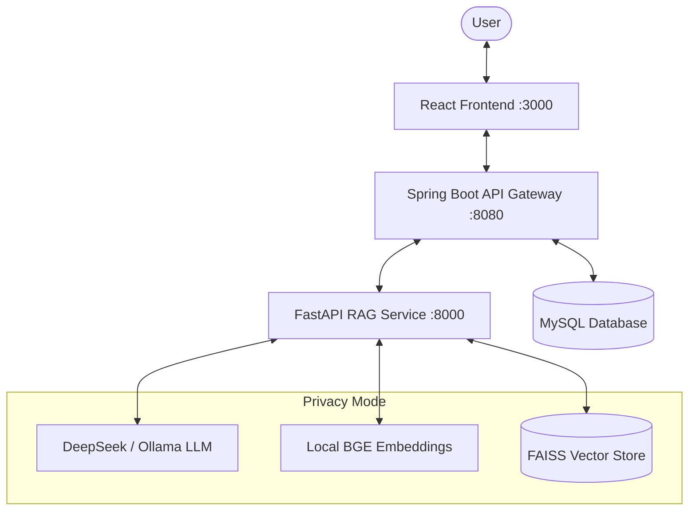

# 🧠 DocMind — Private & Intelligent Document Q&A

[](https://opensource.org/licenses/MIT)
[](https://react.dev/)
[](https://fastapi.tiangolo.com/)
[](https://spring.io/projects/spring-boot)
[](https://ollama.com/)

DocMind is a high-performance, full-stack RAG (Retrieval-Augmented Generation) system. It allows you to upload documents (PDF, Word, PPTX, etc.) and chat with them using state-of-the-art LLMs, while providing clear source citations and confidence scores.

---

## 🏗️ System Architecture



### 🚀 Key Features

*   **Multi-Model Support**: Use cloud models (DeepSeek) or go fully private with **Local LLMs** (Ollama).
*   **Smart Parsing**: Hierarchical chunking for PDFs, DOCX, PPTX, and XLSX using `unstructured`.
*   **Precision Retrieval**: 2-stage pipeline using **FAISS** vector search + **Cohere/Cross-Encoder** re-ranking.
*   **Grounded Answers**: Every response comes with page-level citations and a confidence level (High/Medium/Low).
*   **Secure & Scalable**: JWT-based authentication, RBAC (Role-Based Access Control), and Dockerized deployment.

---

## 🔧 Tech Stack

| Component | Technology |
| :-- | :-- |
| **Frontend** | React 18, Vite, TailwindCSS, Lucide Icons |
| **Gateway** | Spring Boot 3, Spring Security, JWT, MySQL |
| **RAG Engine** | FastAPI, LangChain, PyPDF2 |
| **Embeddings** | BAAI/bge-large-en-v1.5 (Running Locally) |
| **Vector DB** | FAISS / ChromaDB (Switchable) |
| **Reranker** | Cohere Rerank / Local Cross-encoders |

---

## 🚀 Quick Start

### 1. Prerequisites
*   Docker & Docker Compose
*   (Optional) DeepSeek API Key for cloud-based brain
*   (Optional) Ollama for the privacy-first local experience

### 2. Configuration
Clone the repository and set up your environment variables:

```bash
cp backend-python/.env.example backend-python/.env
```

Edit `backend-python/.env` and add your keys:
```env
DEEPSEEK_API_KEY=your_key_here
# Set to true for local LLM (Ollama)
# DEEPSEEK_BASE_URL=http://localhost:11434/v1 
```

### 3. Launch with Docker
```bash
docker-compose up --build
```
The app will be available at:
- **Frontend**: `http://localhost:3000`
- **Spring Gateway**: `http://localhost:8080`
- **RAG API**: `http://localhost:8000/docs`

---

## 🔒 Privacy-First Configuration (Local RAG)

Want to ensure your data **never** leaves your computer? Switch to **Private Mode**:

1.  **Install [Ollama](https://ollama.com/)**.
2.  **Pull a model**: `ollama pull llama3`.
3.  **Update `.env`**:
    ```env
    DEEPSEEK_BASE_URL=http://localhost:11434/v1
    DEEPSEEK_API_KEY=ollama
    # Keep COHERE_API_KEY empty to use local re-ranking
    ```
4.  **Restart the backend**. You are now 100% offline-ready!

---

## 📁 Project Structure

```text
smart-doc-qa/
├── frontend/           # React + Vite UI
├── backend-java/       # Spring Boot Gateway & Auth
├── backend-python/     # FastAPI RAG Pipeline
│   ├── app/services/   # Smart logic (Embedder, Reranker, LLM)
│   ├── app/routers/    # API Endpoints
│   └── uploads/        # Document storage
└── docker-compose.yml  # Orchestration
```

---

## 🔌 API Summary

| Endpoint | Method | Description |
| :-- | :-- | :-- |
| `/api/auth/register` | `POST` | Create a new account |
| `/api/documents/upload` | `POST` | Upload and index a document |
| `/api/chat/ask` | `POST` | Ask a question (Full RAG flow) |
| `/api/analytics` | `GET` | Retrieve usage statistics |

---

## 📄 License
Distributed under the **MIT License**. See `LICENSE` for more information.
